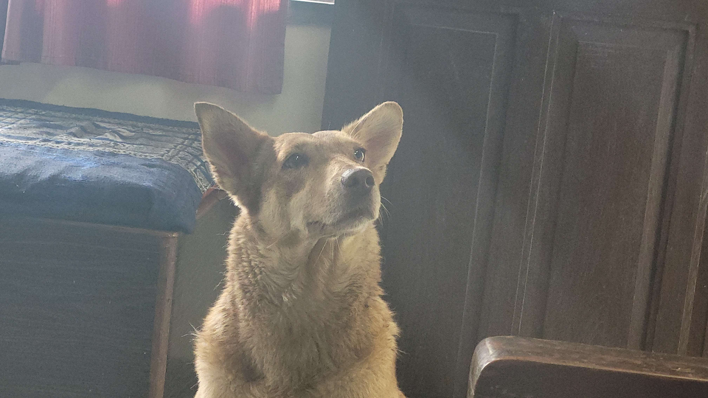

Aditi Bharadwaj's Blog

Hi! My name is Aditi Bharadwaj and I'm a sophmore. I'm so excited to be taking CSP this year and I hope to learn a lot about coding!

I am interested in many things! I love to play violin and tennis. I'm on the JV Tennis Team for my school. I also enjoy travelling, going to the beach, hanging out with my friends, and reading books!
 

Problem Solving

I had some setbacks in the beginning about installing the applications and getting them to work. For example, I installed WSL but had an error with my username. Because of this, I got the prompt of "root" instead of "home". I solved this problem by reinstalling Ubuntu on my computer and redoing the username and password. Now my WSL works fine. I also had some issues uploading my image, at first I didn't know how to insert the image into index, but I realized that all you had to do was paste it! I also had an issue changing the theme, but I learnt that you had to type make clean instead of just make to have it work. Overall, I had some setbacks but I'm happy to know that all of my applications are working good now!

Installation Hack

My favorite command is make. I like this command because it allows me to post my changes on the blog which allows me to see the progress I made and I like to see that.
 

Tools Hack
 

My favorite tool is VS Code because it has a good user interface and it allows me to code easily. I enjoy learning the different commands through practice in VS Code!
 

 
